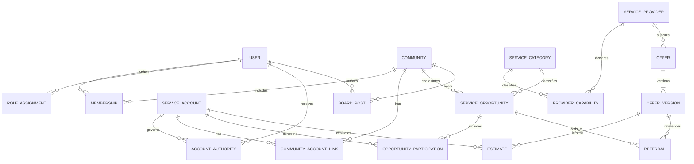

# Community Power domain ontology

Version 0.3 · 25 September 2026 · Proposed domain design for review.

This ontology describes actors, things they act on, relationships, actions, and authority boundaries. It is a conceptual model, not an implemented permission system or a legal determination. The actor vocabulary comes from the user's request; the detailed relationships and action rules below are proposals grounded in [MVP requirements](02_mvp_specification.md), [community benefits](06_community_benefits.md), and the [validation register](08_validation_register.md). No new regulatory or commercial facts are asserted.

## Actors and roles

| Term | Meaning | Acts through | Scope |
|---|---|---|---|
| `consumer` | A person seeking information or services for themselves or an account they are authorized to manage | Authenticated `user` | Own profile, memberships, consents, and authorized service accounts |
| `community` | A group coordinating participation, communication, and service opportunities | People holding explicit community roles | Its memberships, board, opportunities, and approved aggregates |
| `community_admin` | A role assigned to a user for one community | That user's identity and active role assignment | Membership coordination and community administration; no automatic bill access or contracting authority |
| `platform_admin` | A role for authorized Sandz personnel providing platform support and maintenance | Named staff user with an active platform-scoped role assignment and explicit support/maintenance capabilities | Support cases, identity recovery, role administration, platform health, configuration and recovery; sensitive data access requires a separate scoped grant |
| `CP` | Community Power's AI conversational assistant, a system interface rather than an independent authority | Server-authorized tools acting for the authenticated user | Role-appropriate explanations, AI bill-reading suggestions and confirmed actions; no separate privilege or autonomous contracting |
| `service_provider` | An organization offering one or more categories of service | An authorized `provider_representative`, or an operations reviewer recording an attributed submission | Its organization, offerings, and specifically authorized referrals |
| `energy_provider` | A service provider with an energy capability | Same representation rules | Energy offers; capability is not proof of supply authorization or partnership |
| `provider_representative` | A user authorized to act for a provider | Active provider-scoped role assignment | Only that provider's permitted operations |

Supporting roles preserve the MVP boundaries: `operations_reviewer` handles assigned evidence and offer reviews; `moderator` handles board content within assigned communities. Community admins do not automatically inherit these roles or the Sandz platform admin role. Sandz is the support and maintenance organization named by the user; this designation does not establish a supplier relationship or commercial authority.

One user may hold several roles, but permissions must be evaluated for the requested action and resource scope. A role in Community A grants nothing in Community B. A consumer need not own the electricity account: account authority is recorded separately. A community may coordinate individual accounts and have a common-area account, which must remain distinct.

## Core concepts and relationships

| Concept | Key relationships and constraints |
|---|---|
| `user` | An authenticated identity for a person; has zero or more community memberships and role assignments |
| `community` | Has zero or more memberships, service opportunities, and board threads |
| `membership` | Links exactly one user and one community; at most one current membership per pair; retains status history |
| `role_assignment` | Links one user, one role, and one scope (community, provider, or platform); records grantor, start, expiry/revocation, and evidence |
| `service_category` | Stable category identifier; `energy` is initial scope; future categories such as internet or maintenance are proposals |
| `service_provider` | Organization identity with one or more `provider_capability` records; no global “approved for everything” flag |
| `provider_capability` | Links a provider to a service category, service area, and dated verification evidence; may remain unknown or expire |
| `service_account` | The account being assessed; belongs to a category and has separately evidenced controllers; energy subtype adds meter/account type and utility identifiers |
| `account_authority` | Links a user to one service account, with permitted actions, evidence, validity, and revocation; membership alone creates no authority |
| `community_account_link` | Associates an account with a community for a stated purpose and period; does not transfer account ownership or authority |
| `consent_record` | Identifies granting user, authority where needed, purpose, data/resource scope, recipients, notice version, time, expiry and withdrawal |
| `bill` / `usage_record` | Belongs to one service account and period; original and reviewed versions remain traceable; energy measurements carry units |
| `eligibility_case` | Assesses a specific account or defined account group for a category, route, date and evidence set; never inferred from community membership |
| `service_opportunity` | One community's scoped request or coordinated expression of demand for one category; participation is explicit and non-binding |
| `opportunity_participation` | Links an authorized consumer/account to an opportunity; records scope, consent references and withdrawal |
| `aggregate_snapshot` | Derived from authorized, reviewed records; records inclusion set, coverage, purpose and suppression-policy version; not a raw-bill export |
| `offer` / `offer_version` | One provider and category; immutable versions record scope, validity, complete comparison terms and evidence; explicit community visibility records |
| `estimate` | Links an account, reviewed bill versions, offer version, and calculation version; records assumptions and signed positive/negative results |
| `referral` | One consumer/account, community opportunity, provider and offer version; records authorized handoff scope and evidence-backed progress |
| `service_engagement` | Evidence of an external contract or activation related to a referral; recording it does not execute an agreement or switch service |
| `benefit_record` | Account/period outcome with baseline, actual or estimated costs, fees and allocations; distinguishes estimated from measured benefit |
| `board_post` / `board_reply` | Community-scoped content authored by a user; excludes private bill attachments |
| `moderation_report` | Refers to board content in the same community; assigned moderator records reason and resolution |
| `subscription_entitlement` | A user's optional platform upgrade entitlement; independent of community membership, service contracts and eligibility |
| `support_case` | Requester, assigned Sandz staff, affected community/provider/account references, issue, status and resolution; case assignment alone grants no access to referenced private records |
| `support_access_grant` | Named staff user, support case, exact resources and allowed actions, purpose, authorizing party/basis, start, expiry and revocation; separate from the platform role |
| `maintenance_change` | Target environment, affected services, change/incident reference, authorized executor, approval basis, planned window, rollback plan, execution result and verification; references backups/releases without storing secrets |
| `ai_configuration` | Sandz-managed provider/models, secret reference, environment/community scope, usage limits and lifecycle; never a plaintext API key or model-readable secret |
| `cp_conversation` / `cp_message` | Private user/project-owned conversation; minimal authorized context with retention controls; distinct from the shared community board |
| `cp_action_request` | Server-validated proposed action, bound actor/project/payload/version/expiry, explicit approval and idempotent outcome; CP prose is not approval evidence |
| `bill_extraction` | AI candidate fields, document reference, model/schema/prompt versions and uncertainties; not a reviewed bill |
| `knowledge_article` / `knowledge_version` | CP help identity and immutable content; audience/community scope, release/features, sources, owner, review and publication status |
| `knowledge_release` | Validated immutable manifest of compatible article versions; supports retirement and rollback |
| `audit_event` | Records actor, acting role/scope, action, resource/version, time, outcome, reason and evidence references; avoids copying sensitive payloads |

Accounts and providers can participate across communities, but each community-facing link, estimate, opportunity, referral, and board item has explicit community scope. Underlying account data requires account authority or a purpose-specific review assignment as well as a permitted use. Overlapping account links must be deduplicated when producing a combined aggregate. Do not duplicate an account's consumption merely because it has multiple controllers or community links.

The diagram is a relationship overview; scope, consent and review constraints in the tables still apply.

## Action vocabulary

Action names use `resource.verb`. The actor initiates an action; the application checks permission and preconditions before recording a result. “MVP assisted” means operations performs an attributed manual workflow, not that a provider portal is required.

| Action | Initiating actor | Preconditions and result | Phase / requirement |
|---|---|---|---|
| `profile.update` | Consumer | Own identity; update permitted profile fields | MVP / M01 |
| `consumer_import.preview`, `consumer_import.confirm`, `consumer_import.cancel` | Community admin | Own community, email validation, confirmed dispatch, consumer role fixed, retryable row outcomes; no implied consent | MVP / M16 |
| `bill.analyze` | Authorized consumer via CP or direct upload | Account authority and permitted AI processing; returns candidate values for confirmation and review | MVP / M17 |
| `ai.configure`, `ai.test`, `ai.rotate`, `ai.disable` | Sandz platform admin with AI-configuration capability | MFA, dedicated secret form/server endpoint, environment/community scope and audit; CP never receives the key | MVP / M19 |
| `assistant.propose_action`, `assistant.confirm_action` | Authenticated user via CP | Current role/account scope; exact payload-bound confirmation and idempotent server execution; no privilege escalation | MVP / M11 |
| `knowledge.search` | User via CP or direct help | Published, available, current content matching audience/community and release/features; cite version; abstain/escalate on gaps | MVP / M20 |
| `knowledge.draft`, `knowledge.submit_review` | Designated knowledge editor | Versioned source/evidence; code/help reviewed together; no private records or secrets | Development and MVP / M20 |
| `knowledge.publish`, `knowledge.retire` | Sandz staff with knowledge-publisher capability | Designated reviewer approval and validated compatible manifest; retirement invalidates retrieval; CP cannot self-publish | MVP / M20 |
| `membership.request` | Consumer | Select community or redeem valid invitation; creates pending membership | MVP / M01 |
| `membership.invite`, `membership.approve`, `membership.suspend` | Community admin | Active admin grant in target community; changes membership with reason/history | MVP / M01 |
| `membership.leave` | Consumer | Own membership; removes community access; separate consent and retention rules still apply | MVP / M01, M14 |
| `community.update` | Community admin | Own community scope; changes description/settings, not members' account authority | MVP / M01 |
| `role.grant`, `role.revoke` | Sandz platform admin with role-management capability | Verified assignment basis and delegable scope; cannot grant capabilities beyond delegation or approve own elevation; platform-level grants require independent authorization | MVP / M13; bootstrap policy pending |
| `support.request` | Consumer, community admin, or provider representative | Own issue and permitted resource references; creates a support case without automatically sharing private records | MVP / M15 |
| `support.triage`, `support.assign`, `support.resolve` | Sandz platform admin with support capability | Assigned queue/case scope; record diagnosis, assignment, resolution and requester-facing status | MVP / M15 |
| `identity.recovery_initiate`, `identity.session_revoke` | Sandz platform admin with identity-support capability | Verify requester or documented security incident; use controlled recovery flow, never retrieve passwords or impersonate user consent | MVP / M14, M15 |
| `support.access_request` | Assigned Sandz platform admin | Specify case, purpose, resources, actions and expiry; creates pending grant | MVP / M15 |
| `support.access_authorize`, `support.access_revoke` | Authorized resource controller or designated independent approver under reviewed support policy | Verify authority and permitted processing basis; staff cannot approve their own access; unresolved authority means deny | MVP / M15; policy pending |
| `support.record_view` | Assigned Sandz platform admin | Current scoped access grant; log each sensitive read; no unrestricted browsing or export | MVP / M15 |
| `platform.health_view`, `platform.logs_view` | Sandz platform admin with diagnostics capability | Operational metrics and redacted logs only; private payloads require separate access authorization | MVP / M15 |
| `platform.config_update`, `maintenance.schedule`, `maintenance.execute`, `maintenance.rollback` | Sandz platform admin with maintenance capability | Approved change and target environment; record versions, impact, outcome and rollback evidence; preserve access and consent controls | MVP operational process / M15 |
| `backup.verify`, `backup.restore_test`, `backup.restore` | Sandz platform admin with recovery capability | Approved runbook/change; isolated test restore first; production restore needs explicit authorization and reconciliation of later revocations/deletions before reopening access | MVP operational process / M14, M15 |
| `account.register`, `account.authority_submit` | Consumer | Own request with account-control evidence; creates pending account/authority review | MVP / M03, M06 |
| `account.authority_review` | Assigned operations reviewer | Evidence and assigned scope; records accepted/rejected/needs-information decision | MVP / M04, M06 |
| `consent.grant`, `consent.withdraw` | Consumer | Own grant, purpose and scope; account-data sharing additionally requires account authority; withdrawal blocks future use under that grant | MVP / M02 |
| `bill.submit`, `bill.correct` | Authorized consumer | Account authority; correction creates a new version | MVP / M03, M04 |
| `bill.review` | Assigned operations reviewer | Purpose-specific access; accept or request correction with evidence | MVP / M04 |
| `eligibility.review` | Assigned operations reviewer | Dated evidence for exact account/group and route; record scoped outcome | MVP / M06 |
| `opportunity.create`, `opportunity.update`, `opportunity.close` | Community admin | Own community; describes non-binding category, scope, period and participation criteria | MVP / M05, M09 |
| `opportunity.join`, `opportunity.withdraw` | Consumer | Active membership and account authority when including account data; explicit participation | MVP / M02, M05, M09 |
| `aggregate.view` | Community admin or assigned reviewer | Reviewed and authorized inputs; privacy suppression; community and purpose match | MVP / M05 |
| `provider.record`, `provider.capability_review` | Operations reviewer | Record source, category, area, evidence and review date; unknown stays unknown | MVP assisted / M07 |
| `offer.submit` | Provider representative via operations | Attributed submission with terms; creates draft, never auto-publishes | MVP assisted / M07 |
| `offer.review`, `offer.publish`, `offer.withdraw` | Assigned operations reviewer | Complete terms, scoped provider evidence and appropriate feasibility gates; publish only to designated communities | MVP / M07 |
| `offer.compare`, `estimate.view` | Consumer | Visible offer and authorized account data; show version, uncertainty and negative savings | MVP / M07, M08 |
| `referral.request` | Consumer | Own explicit interest in visible offer; no contract or activation implied | MVP / M09 |
| `referral.handoff` | Assigned operations reviewer | Current recipient-specific sharing authorization, account authority and applicable eligibility/offer checks; disclose only approved fields | MVP assisted / M02, M09 |
| `referral.acknowledge` | Provider representative via operations | Only the provider's authorized referral; record attributed acknowledgement | MVP assisted / M09 |
| `engagement.record` | Assigned operations reviewer | External evidence for contracted/active status; record source and effective date | MVP tracking only / M09 |
| `benefit.view`, `benefit.dispute` | Consumer | Own authorized account; view measured/estimated results or request correction | MVP / M08 |
| `board.post`, `board.reply`, `board.report` | Consumer or community admin | Active community membership; no private bill attachments; reports do not confer moderation powers | MVP / M10 |
| `board.pin`, `board.hide`, `report.resolve` | Assigned moderator | Same community; reason, actor and timestamp retained | MVP / M10 |
| `assistant.ask` | Consumer, community admin or Sandz platform admin | CP uses approved knowledge and data authorized for the current project/role; explanation, task proposal or human escalation | MVP / M11 |
| `entitlement.request` | Consumer | Optional upgrade with visible terms; free core functions remain available | MVP / M12 |
| `entitlement.record` | Authorized platform admin | Record trial/approved entitlement and evidence; does not collect money | MVP manual / M12 |
| `data.export` | Consumer for own data; assigned reviewer for scoped operations export | Re-evaluate authority, purpose and consent at export time; record audit | MVP / M13 |
| `data.request_deletion` | Consumer | Own request; reviewed retention/deletion workflow; no promise of immediate erasure of every record | MVP / M14 |
| `provider.profile_manage`, `offer.manage_draft`, `referral.update` | Provider representative | Provider-scoped self-service with separate verification and access controls | Later; assisted equivalents above cover MVP |
| `service.book`, `contract.sign`, `payment.collect`, `service.switch` | To be determined per service category | Separate authority, feasibility and implementation decisions required | Outside MVP |

A community is the represented entity for community actions, not a shared login. Every action records the actual person and the scope in which they acted. Provider representatives have no resident-directory or board access through their provider role; any consumer role is evaluated separately.

## Authority rules

Authorization requires an active identity, a permitted role or ownership relationship, matching resource scope, and action-specific authority/consent/evidence. Default is deny. UI visibility alone is never enforcement.

1. Membership grants community participation, not account control. Account control grants no access to another consumer's profile or private consents.
2. Community administration does not authorize binding residents, sharing their bills, certifying eligibility, or approving one's own role escalation.
3. Admin and moderator are separate grants. Suspending or ending membership disables associated community-role access; restoration requires an explicit role review.
4. Consumers control their own consent grants. An admin cannot provide blanket consumer consent. Conflicting account-controller claims require review before sharing.
5. Every handoff checks the current recipient, resource scope, purpose, expiry and withdrawal state. Withdrawal stops future disclosures under that grant; it does not assert that already disclosed data has been recovered. Retention and downstream requests need a reviewed policy.
6. Provider capability verification is category-, geography-, route- and date-specific where applicable. An offer's publication does not verify any consumer's eligibility.
7. Participant benefit, provider fees, platform revenue and community transfers remain distinct concepts. Benefits can be negative; estimates are not measured outcomes.
8. Free bill overview, basic comparisons and board access do not depend on paid entitlement. A platform subscription is separate from an energy service contract.
9. AI acts under the caller's effective access, with no independent authority to grant consent, determine eligibility, contract, or switch service.
10. Aggregate disclosure requires a reviewed suppression policy. Until configured, suppress potentially identifying aggregates rather than inventing a safe minimum count.
11. Sandz platform administration spans platform operations, not unrestricted consumer data. Assign support, identity, role-management, diagnostics, maintenance and recovery capabilities separately under `platform_admin`; staff receive only their assigned capabilities. Named staff accounts use MFA, and leaving the support team revokes grants and sessions.
12. Support access is case-bound, purpose-bound and time-limited; expiry, revocation or case closure ends it. No self-approval, silent impersonation, consent override, or routine raw-bill access. Platform admins do not inherit offer approval, eligibility review, or board moderation authority. Any emergency access requires a separately approved policy, independent authorization and audit; it is unavailable while that policy is unresolved.
13. Configuration, deployment and backup tools must enforce their own environment permissions. An ontology role does not authorize a real deployment or production restore. Maintenance must preserve audit history and must not resurrect withdrawn sharing grants or deleted data into active use.

## State and event semantics

| Object | Proposed transitions | Guard |
|---|---|---|
| Membership | pending → active/rejected; active → suspended/left; suspended → active/left | Community approval or own leave; explicit restoration; role access reviewed separately |
| Account authority | pending → accepted/rejected; accepted → expired/revoked | Evidence-backed assigned review; scope and validity retained |
| Consent | active → withdrawn/expired; new permission creates a new grant | Never overwrite the historical grant or reactivate withdrawn consent silently |
| Bill | draft → submitted → reviewed/needs_correction | Correction makes a new version; estimates retain their original input references |
| Eligibility case | unknown → in_review → verified/not_eligible; changed facts/expiry → in_review | Exact route, scope, date and evidence; unusable as current verification after expiry |
| Opportunity | draft → open → closed/cancelled | Opening requires community admin; no acceptance or contract inferred from joining |
| Offer | draft → reviewed → published → expired/withdrawn | Material amendments create a new version requiring review |
| Referral | interest → consented_handoff → acknowledged → contracted → active; pre-contract stages may become cancelled | Later stages require external evidence; post-contract termination is a separate external process |
| Moderation report | open → triaged → actioned/dismissed | Community-scoped moderator and recorded reason |
| Support case | open → triaged → in_progress/waiting_on_requester → resolved → closed; resolved/closed → open on reopen | Assigned support capability; closure ends case access grants; reopening requires fresh grants |
| Support access grant | requested → active/denied; active → expired/revoked | Verified independent authorization; no sensitive access while pending |
| Maintenance change | proposed → authorized → scheduled → in_progress → verified/failed; failed → rolled_back after recovery | Environment-specific permission, verification and rollback evidence; failed rollback remains failed with an incident |

Commands describe intent (`membership.approve`); events describe what occurred (`membership.approved`). Proposed event envelope: `event_id`, UTC `occurred_at`, `actor_user_id`, `acting_role`, `scope`, `action`, `resource_type`, `resource_id`, `resource_version`, `outcome`, `reason`, `evidence_refs`, and `correlation_id`. External submissions also identify the attributed submitter and the recording reviewer. Avoid raw bill or credential content in audit logs. Retried state-changing requests use an idempotency key; authorization is rechecked and duplicate transitions do not create duplicate referrals or grants.

## Energy now, other services later

Reuse identity, membership, consent, provider, opportunity, offer, referral, board and audit concepts across categories. Keep service-specific details in typed extensions with explicit versions:

- Energy: meter/account configuration, kWh and demand as distinct quantities, billing periods, rate components, eligibility route and comparable-cost calculations.
- Internet (future example): service address/coverage, bandwidth units, installation terms and service levels.
- Maintenance (future example): property authority, job scope, appointment, quote and completion evidence.

A provider can have multiple capabilities. Each offer belongs to one category; a future multi-category bundle must reference explicit component offers. Energy eligibility and savings formulas must not be reused automatically for another category. Adding a category requires its own evidence, terms, data policy and permitted-action review; these examples are not approved scope or provider relationships.

## Proposed acceptance examples

These are specifications for future implementation tests, not tests already implemented by the repository harness.

| Given / action | Expected result |
|---|---|
| Admin of Community A requests Community B's membership list | Deny |
| Community admin requests a member's raw bill without separately granted review authority | Deny |
| Active member without account authority attempts to share an account bill | Deny |
| Consumer withdraws provider-sharing consent before queued handoff executes | Block handoff; record reason |
| Provider A requests Provider B's referral, or unrelated residents | Deny |
| User has both provider and consumer roles and requests provider access to community bill data | Deny unless the specific action independently satisfies the required access rules |
| Consumer joins an opportunity or posts support on the board | Record participation/post only; no consent, contract or activation inferred |
| Consumer compares an offer that costs more | Show negative savings |
| Offer expires between viewing and requesting handoff | Block handoff pending current reviewed terms |
| One account appears in two community links in a combined aggregate | Count the authorized account-period once |
| Consumer has no paid entitlement | Permit authorized basic overview, comparison and board actions |
| Retry of the same successful referral request | Return existing result; no duplicate referral |
| Sandz support admin opens an unassigned consumer bill without a current support access grant | Deny |
| Sandz staff attempts to approve their own elevated role or sensitive support access | Deny |
| Support grant expires or case closes while a staff session remains active | Deny subsequent sensitive reads; retain audit history |
| Sandz diagnostics admin views system health | Allow assigned operational metrics; redact consumer payloads |
| Sandz support-only admin attempts production configuration change | Deny without maintenance capability and authorized change |
| Backup predates a consent withdrawal or deletion request | Reconcile subsequent revocations/deletions before restored data becomes available |

## Decisions still needed

- Community creation and first-admin verification: who validates the community and grants the first admin role?
- Admin onboarding now follows the user's requested flow: community admin supplies email to Sandz; platform admin initiates a Supabase Auth invitation. Community admins can import consumer emails with preview and confirmed dispatch. Identity verification evidence remains open; import does not grant consent or account authority.
- Sandz operations: name the initial platform-role grantor and independent approvers; define capability delegation, support-data authorization, emergency access, retention, maintenance windows and production recovery runbooks. The role and purpose are user-requested; these detailed controls remain proposed.
- Membership policy: invitation only, admin approval, or another evidence-based join process? This draft defaults to pending approval.
- Account authority: which evidence is sufficient for household members, tenants, common-area representatives and multiple controllers?
- Community governance: can admins invite other admins, and under what approval process? This draft reserves role grants to platform administration.
- Privacy: aggregate suppression, retention, withdrawal handling and cross-community account use require review (V08).
- Provider access: when should assisted submissions become a provider portal, and who validates representation and capabilities (V05)?
- Commercial authority: representation, contracting and fees remain open (V01–V07); no role label resolves them.

Next implementation artifact: translate this reviewed model into a relational schema and an action-policy table, then implement role/community isolation tests before connecting real data.

The [architecture draft](13_architecture.md) maps these concepts to a shared Next.js PWA, proposed per-community Supabase projects, CP tool boundaries and AI bill analysis. One conceptual person can have distinct community-local Auth identities; the initial design does not implement a global user login.
