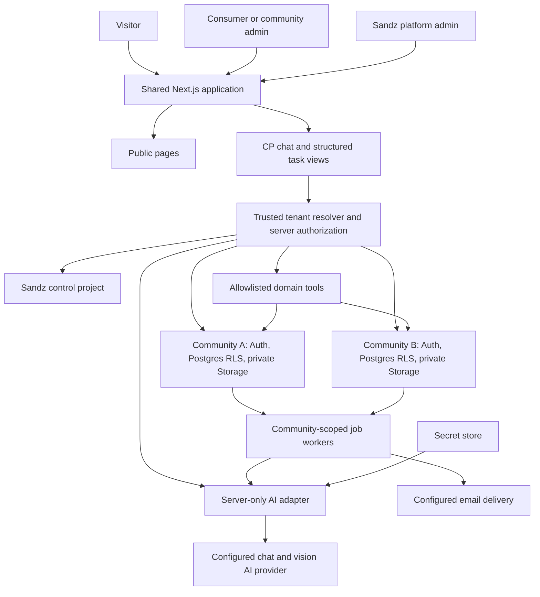
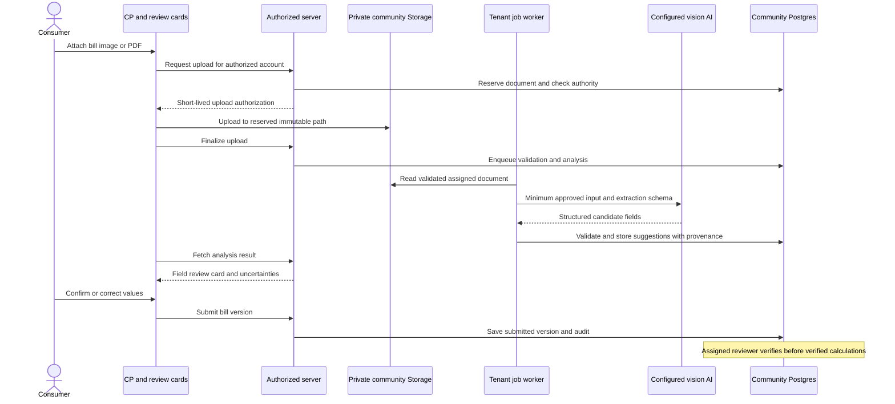

# Community Power architecture

Version 0.2 · 25 September 2026 · Architecture baseline; first synthetic UI implemented, live infrastructure/integrations not provisioned.

## Decisions and scope

Build a supplier-neutral, mobile-friendly platform with one maintained codebase, separate community databases, invitation-based onboarding and a minimalist conversational interface led by **CP**, the Community Power assistant. Preserve the community board, useful free consumer features, optional upgrades, and feasibility before the 1–3 community pilot.

The user selected React/Next.js, a progressive web app (PWA), Supabase, a database per community, admin-led invitations, three dashboards, AI bill reading, and an AI API key supplied by Sandz's platform admin. Hosting, exact project topology, login method and detailed controls below are proposals. Read alongside the [ontology](12_domain_ontology.md) and [MVP specification](02_mvp_specification.md).

| Layer | Initial design | Reason / tradeoff |
|---|---|---|
| Application | TypeScript + React through Next.js App Router | Next.js is the React framework; one application handles public pages, chat and dashboards |
| Experience | Responsive PWA with CP chat, structured cards and small task views | Chat is the main entry point; review tables, forms and buttons keep precise tasks usable |
| Community data | One hosted Supabase project per community | Each project has its own Postgres instance; proposed mapping also isolates Auth and private Storage [T2] |
| Sandz operations | Separate Supabase control project | Registry, staff, provisioning and maintenance; no central copy of household bills |
| Identity | Community-local Supabase Auth; separate Sandz staff Auth | Native local JWTs and RLS; separate community sign-ins initially |
| Server | Next.js server components/actions and route handlers | Authorization, tool execution and secret-bearing operations run server-side |
| Persistence | Postgres tables, SQL functions, RLS and private Storage | Database enforcement supplements server authorization |
| AI | Server-only provider adapter with chat and vision/document-capable models | Configurable provider/model; structured extraction and tools; no dedicated OCR service in the initial design |
| Background work | Durable per-community queue plus bounded workers | Imports, invitations and bill analysis survive HTTP timeouts [T9, T10] |
| Delivery | One repo, shared tenant migrations, one app release per environment | Community branding/settings are data; no community-specific code forks |

Pin compatible supported Next.js, React, Node and Supabase package versions when scaffolding. Provider/model, domain, host and email service remain unselected. This document does not purchase services, create users, send invitations, deploy, or process real bills.

## System layout



The AI proposes tool calls; the server authorizes and executes them. It never receives database credentials or unrestricted database access. Worker code is shared but every job is bound to a trusted community/project. Raw community bill data and private chat histories stay out of the control database. Approved processing can send necessary content to the configured AI provider; database separation does not imply data never leaves Supabase.

## One codebase, separate community databases

### Project and routing model

For N production communities, propose N community Supabase projects plus one Sandz control project. Non-production projects are additional. Use the same tenant schema, RLS, functions and app build for all communities. Keep control and tenant migrations separate.

Proposed hosts, with the domain to be supplied later:

- `www.<domain>`: public landing/about pages.
- `<community-slug>.<domain>`: community PWA and local login.
- `admin.<domain>`: Sandz platform dashboard and staff login.

A server-owned registry maps an allowlisted hostname to community ID, Supabase project reference/URL, publishable key, schema version and lifecycle state. Privileged keys live in a secret store; registry rows hold secret references only. Resolve the trusted canonical host before selecting a client. Reject unknown hosts and untrusted forwarded-host headers; never connect to a URL or project supplied in chat, CSV, email domain or request body.

Use per-request Supabase clients. Verify session issuer, audience and validity against the selected project, then read current membership/role status. A Community A token must fail in Community B and in the Sandz project. Never mutate a shared global Supabase client between requests. Use project-specific, host-only secure cookies; do not share parent-domain session cookies. Cookie sessions and refresh follow `@supabase/ssr`; verify authentication rather than trusting `getSession()` contents alone. [T3]

### Identity tradeoff

Propose independent community accounts for the pilot. The same email can have different Auth UUIDs in different projects. A person in two communities signs into each separately; there is no automatic cross-community SSO. Use `(project_id, local_user_id)` for external references, not email as a global identity. The control-project JWT is not a tenant user token.

Sandz staff use control Auth for operations. Sensitive tenant support additionally requires a mapped tenant-local staff identity, local MFA session and an approved local support grant. A staff role in the control project is not automatic access to community bills.

If a unified cross-community login becomes essential, revisit identity federation before implementation. Sending central Auth tokens to unrelated projects or using service-role keys for all consumer requests is not the proposed solution.

### Operational consequences

Separate projects improve data separation and independent community restoration, but multiply provisioning, email/Auth configuration, migrations, secrets, backups and monitoring. RLS still separates consumers and roles inside a community. The shared app and its privileged adapters remain a potential cross-community failure boundary.

No free-tier capacity or pricing is assumed. Estimate project compute, storage, email, AI, support and recovery costs separately. These costs have not been added to the model. The indicative 8–10 weeks / PHP 400k–700k build assumption needs scoped validation against this architecture.

## Minimalist interface and public pages
Implementation styling decision: use the user's supplied CP-Logo.png unchanged as branding and the CP launcher, framed with CSS; Ukraine-flag blue `#0057B7` and yellow `#FFD700`, light surfaces, subtle circuit-grid/orbital accents and restrained motion. The first implementation is a public synthetic preview, not authenticated production role views.


The signed-in layout has a compact community/role header, CP conversation, attachment button, a few suggested actions and a small navigation menu. Use generous whitespace, clear text and restrained color. CP introduces himself as an AI assistant and explains what he can do. Answers link to relevant records, input versions or approved FAQ sources.

Chat is not the only control. Invitations, bill corrections, consent, destructive actions and financial comparisons use accessible cards/tables/forms with explicit buttons. Users can reach the same functions directly without composing prompts. Long import results and bills open focused task views; avoid forcing a spreadsheet into a chat bubble. The community message board remains a shared feature, separate from a private conversation with CP.

| Surface | Initial content / actions |
|---|---|
| Landing | Describe bill understanding, voluntary community coordination, reviewed offer comparison, benefit tracking and the board; “Sign in to your community” and “Request a community discussion” |
| About | Purpose, supplier neutrality, community model and Sandz support role; actual people/company details supplied later |
| How it works | Invitation → consent → bill capture/review → comparison → voluntary referral; interest is not a contract |
| FAQ / contact | Free features, optional upgrades, data handling, uncertainty and support; contact process to be supplied |
| Privacy / terms / accessibility | Approved text before real onboarding; placeholders are drafts, not published approved policies |
| Consumer dashboard | CP plus bill/review status, scan/upload, comparisons, estimated/measured benefit, consent, referrals, board and support |
| Community admin dashboard | CP plus member/invitation/import statuses, settings, opportunities and privacy-safe aggregates; no raw bills by default |
| Sandz platform dashboard | CP plus community lifecycle, invitations, health/schema versions, support, maintenance and AI settings; no global household-bill browser |

The free tier includes basic bill overview, comparison and board use. AI usage can have transparent operational quotas, but a quota or AI outage must not remove those functions. Moderation and operations-review task views require their distinct role assignments. Provider self-service is deferred; reviewed offers/referrals remain operations-assisted.

## Supabase Auth and onboarding

### Invite a community admin

1. Prospective community admin provides email and community details to Sandz's platform admin. Sandz verifies the request/authority basis and records who approved it.
2. For a new community, provision its Supabase project with shared migrations, private buckets, RLS, Auth/SMTP and exact callback configuration. Keep it unavailable until baseline checks pass.
3. A Sandz admin with onboarding capability creates a pending local `community_admin` invitation: normalized email, role, authorizer, expiry, idempotency key and target project.
4. The server-only adapter calls the target project's `auth.admin.inviteUserByEmail(email, { redirectTo })`. Supabase sends the link to that address. Sandz initiates delivery from the dashboard, preserving the requested create-user-and-email-link flow without copying bearer links into support messages. [T4]
5. Bind the returned Auth user ID to the invitation. Auth creation, email delivery and database changes are not one transaction: reconcile partial failures and show retryable states. An orphan Auth user receives no application privileges.
6. Recipient follows the community callback, verifies through Auth, sees the welcome/notice screen and accepts. A transaction locks the invitation, checks its current state, expiry and bound verified identity, then creates membership and role exactly once. User-editable metadata or a client-supplied role cannot grant access.
7. Proposed repeat login is email/password; the invited user sets their own password during activation. Require MFA before community-admin or Sandz privileged operations. Passwordless repeat login is an open product choice. [T12]

For an existing Auth user, keep the identity and issue an application invitation directing them to normal login. Do not recreate accounts, overwrite roles or auto-confirm email to bypass errors. Revoked/expired application invitations cannot activate roles even if an old Auth link still establishes a session. Callback `next` paths are internal and allowlisted; invitation tokens never enter analytics/logs. Exact redirect URLs and custom SMTP must be configured for production. Supabase's default sender is restricted and intended for testing. [T5, T6]

### Bulk invite consumers

1. Community admin asks CP to add members or opens **Import consumers**, then supplies UTF-8 CSV with required `email` and optional `display_name`. No passwords, bill data, consent flags or elevated roles are accepted.
2. Server validates rows and shows a preview of valid, duplicate, already-member, already-invited and invalid addresses. Normalize consistently with Auth without provider-specific dot/plus rewriting. Protect generated CSV reports against formula injection.
3. Admin confirms a specific preview and the basis for contacting these community members. Upload alone sends nothing. The import is fixed to `consumer`; changing prompt or CSV fields cannot grant admin.
4. Store the import and row outcomes locally. Queue bounded, idempotent invitation jobs, with rate limits, retry/backoff, cancellation and visible failures. Recheck the initiating admin's authority before dispatching unsent work.
5. Each consumer follows the same verified invitation acceptance flow. Import does not establish account ownership, data-sharing consent, electricity eligibility or service activation.
6. Admin sees sent/accepted/failed/expired counts and can retry or revoke eligible invitations. Retention for source CSV and row emails is configurable under the reviewed policy.

Public signup is initially a request-access/inquiry flow. An Auth account alone never grants community membership. Disable automatic account creation in ordinary login flows where supported. Suspension/revocation is checked in current application tables, even while a JWT remains unexpired. Invitation expiry, batch limits and evidence requirements must be configured before live use.

## CP assistant and AI configuration

### Platform-admin API key

Sandz's platform admin manages **Settings → AI**: approved provider, chat model, bill-reading model, environment, permitted community scope and usage limits. The provider must support the chosen image/document inputs and structured output through its adapter; capabilities are verified during implementation, not assumed from an API-key field.

Use a dedicated secret input, never ask the admin to paste the key into CP chat. Submit over TLS to a capability-checked server endpoint with MFA. Store the value in the hosting runtime's managed secret store, or Supabase Edge Function secrets for an Edge-hosted adapter. Supabase documents server-side secret handling for those functions. [T16] The exact secret-store integration depends on hosting selection; do not ship a dashboard save button that only writes a plaintext database field.

Persist only `secret_ref`, provider/model identifiers, masked display metadata, environment/scope, configured/tested/disabled status, updater and rotation timestamp in control tables. Never return the saved key to the browser, put it in `NEXT_PUBLIC_*`, logs, chat history, model context, migrations or Git. A harmless test uses synthetic input and records status/usage without revealing the key. Allow rotate/revoke; revocation blocks new calls. Sandz's application role does not automatically grant infrastructure secret-management privileges: the server integration is separately permissioned.

Propose one Sandz-managed credential configuration per environment with an explicit list of allowed communities initially; community-specific keys can be added later. Enforce community-level token/request/file limits and budget reservations server-side, plus a global concurrency ceiling. Record usage by community/job without bill content. Missing/invalid keys, exhausted allowance or outages fall back to manual tasks and FAQs. AI provider selection, retention/training settings, processing location and terms require review before live bills or private chat data are sent.

### CP request and action flow

1. Resolve tenant and verify the user, current capabilities and requested conversation ownership. The model cannot choose another tenant.
2. Assemble minimal context from authorized queries and the release-compatible published CP wiki described below. A private chat does not inherit another member's bill or the entire board. Recheck referenced data rights on each turn.
3. Call the configured model with a fixed role-aware tool catalogue and validated structured schemas. Treat bill text, filenames, uploaded files, board content and retrieved text as untrusted data.
4. CP may answer, request missing data, or propose a tool call. The server derives actor/community, validates arguments and enforces the same domain policies used by direct UI actions. No arbitrary SQL, arbitrary URL fetching, shell execution or secret-retrieval tool.
5. For invitations, consent, data sharing, deletion and role changes, render a deterministic confirmation card from server-validated proposed arguments. Bind approval to user, tenant, exact payload/hash, resource versions and expiry. A changed recipient, role or payload needs a new confirmation; prose from CP is not proof of consent.
6. On confirmation, recheck permissions and current state, execute the transaction, audit it and return the actual result. Use idempotency keys; a retried chat turn cannot send duplicate invitations or create duplicate grants.

Initial tools: `get_my_bill_summary`, `start_bill_upload`, `get_bill_analysis`, `submit_bill_corrections`, `compare_reviewed_offers`, `get_consent_status`, `open_support_case`; for admins add import preview/confirmation and authorized roster summaries; for Sandz add operational summaries and onboarding proposals. High-risk infrastructure restore, secret updates and production deployment remain dedicated controlled task flows; CP may guide or navigate to them but cannot execute them autonomously.

CP is an interface acting under the caller's authority, not a new privileged role. He cannot certify eligibility, guarantee savings, manufacture consent, silently alter bill evidence, contract or switch service. Financial calculations run in deterministic code; CP explains the results. Audit tool proposals, approvals and outcomes separately from conversational prose. Chat retention and redaction/deletion policy are distinct from required operational audit retention; do not store whole images or keys in transcripts.

## CP knowledge wiki

Maintain `wiki/` in this repository as the source of platform help throughout development. The [wiki maintenance guide](../wiki/README.md) defines article metadata, review workflow and starter evaluation cases. Code and related help change in the same PR; a no-impact explanation is required otherwise. The wiki explains demonstrated behavior; architecture proposals and unreviewed support answers are not production help.

**Authoring and review:** stable article IDs, versioned Markdown, audience/community scope, required features, supported releases, owner, actual reviewer, sources and review deadline. Draft → in review → approved → published → retired; edits require fresh review. Sandz's separate knowledge-editor/publisher capabilities govern publication. CP may flag gaps or propose drafts but cannot approve or publish them. Starter guides are planned drafts and cannot be retrieved as live help.

**Publishing:** validate metadata, links, sources and answer fixtures; build a read-only index of compatible approved versions. The application release references an immutable wiki manifest/content hash. Activate a validated snapshot atomically; rollback selects a compatible prior snapshot. Retiring unsafe or stale content invalidates retrieval/response caches independently of app deployment. Never silently serve stale help when no eligible article remains.

**Storage:** add `knowledge_articles` (identity/scope), `knowledge_versions` (immutable content, approval, release/feature metadata), `knowledge_chunks` (version/section/search text and optional embeddings), `knowledge_releases` (manifest) and `knowledge_feedback` (minimal knowledge-gap report). Editorial metadata can live in the control project. Deploy only authorized global audience content and that community's reviewed local content into its tenant index; staff-only articles stay in the control index. Public help includes only explicitly public articles. No bills, secrets, rosters or private chat transcripts belong in this wiki/index.

**Retrieval and RLS:** `knowledge.search` derives identity, audience, tenant and release from trusted server context. Before content enters the model, filter published/available/unexpired versions by release, enabled features and exact global/community scope. Enforce equivalent row/function policies; a query parameter cannot select the caller's role. Each chunk inherits article restrictions. Search similarity is not access control. Community guidance cannot override global security rules; article links enforce the same permissions as search.

**Answers:** CP cites the relevant help title/link and version. Authorized live tools answer account-specific questions; the wiki explains general workflows. Missing, conflicting, stale or disabled-feature guidance yields an uncertainty statement and support path. Retrieve current sources on subsequent turns. Wiki text cannot override tool permissions. Caches include tenant, audience/capabilities, app release and wiki snapshot; retirement/revocation invalidates them.

**Validation:** release tests cover answer accuracy/citations, abstention, planned/retired/expired exclusion, cross-role/community denial, release mismatch, feature flags, malicious article text, index activation and rollback. Reviewers and cadence remain to be assigned. The parser, publisher, index/RLS and runtime evaluations are planned work; the current repository harness does not implement them.

## AI bill-reading workflow

Replace the earlier OCR-service proposal with **vision/document AI extraction** behind the configured adapter. Consumer says “CP, read my bill” or taps **Add bill**, then photographs a bill, selects an image/PDF or uses manual entry.



Capture supports legibility guidance, retake and crop/rotation; file selection remains available when camera capture is unsupported. Propose JPEG/PNG/PDF initially; detect unsupported formats such as HEIC and give a conversion/manual path. Define file-size, image-dimension and page-count limits. Validate content signatures, not extensions alone, and quarantine until type/safety checks pass. Server-side PDF rendering, if needed by the chosen model, is bounded and sandboxed.

The worker receives only an authorized document job. It rechecks processing permission and deletion/cancellation state before sending data and before persisting results. Supply minimal input to the approved provider; do not make the bill public to give the AI a URL. If the provider needs a URL, use a narrowly scoped short-lived signed URL and account for its bearer lifetime. Model-returned instructions embedded in a bill cannot invoke CP tools.

Schema fields: document type, printed supplier/utility, masked account/meter reference, billing period, readings if present, kWh, explicitly stated demand with units, charge components, total billed, amount due, amount paid and due date as separate fields. Require source page/region or text evidence when available, null for missing data, warnings for ambiguity, and provider/model/prompt/schema versions. Model confidence is an advisory signal, not a calibrated guarantee or verification.

An energy payment receipt may contain only amount paid; do not invent kWh or treat it as a full bill. CP explains missing fields and requests the full bill or supported manual data. Deterministic validation flags invalid dates/units, arithmetic discrepancies and duplicates by document hash and account/period. Never silently overwrite corrected values or discard a legitimate revision.

Keep document/job states separate from bill states: job `queued → validating → analyzing → succeeded/failed/cancelled`; extraction result awaits user confirmation; bill `draft → submitted → reviewed/needs_correction`. Consumer confirmation is not reviewer verification. Each correction creates a version; estimates reference reviewed versions and a calculation version. Failed/low-quality analysis offers manual entry.

Supabase Queues can hold durable jobs; a scheduled dispatcher/worker must still execute them. Use leases, bounded retries/backoff, dead-letter status and idempotent result commits. AI rate limits and timeouts cannot leave users with a silent spinner. Short Edge Functions can dispatch or handle verified callbacks; work exceeding runtime limits needs a separate worker built from the same repo. [T9, T10]

## Supabase tables and storage

This is a schema inventory, not executable migrations. Use UUID keys, UTC timestamps, fixed-decimal money and explicit units/currencies. Constrain state values, index policy/foreign-key fields and use immutable versions for bills/offers. Every tenant-domain row has `community_id`, constrained to this project's singleton community configuration. Related-resource foreign keys must preserve scope.

### Sandz control project

| Tables | Purpose / key fields |
|---|---|
| `staff_profiles`, `staff_role_grants` | Local Auth ID, status, explicit capability, authorizer, validity; no client-editable privileges |
| `communities` | Global community ID, slug/verified host, project reference and public config, secret references, lifecycle/schema version |
| `provisioning_runs`, `admin_onboarding_requests` | Request/evidence, requested email, authorized operator, idempotency key, target invitation and reconciliation status |
| `tenant_health`, `migration_runs`, `maintenance_changes` | Operational health, version rollout, authorized change, verification and rollback evidence |
| `support_case_index`, `support_staff_bindings` | Minimal routing and control-to-tenant staff mapping; no raw bill or case payload replication |
| `ai_configurations`, `ai_usage_summaries` | Provider/models, secret reference, environment/community allowlist, budgets/status and aggregate usage; never the plaintext key |
| `cp_conversations`, `cp_messages`, `cp_action_requests` | Staff-owned operational chat and proposed/confirmed actions; no unrestricted tenant content |
| `platform_audit_events` | Append-only attributed operational and security events through controlled functions |

Only Sandz identities use control Auth. Public website content is code/content files initially; a public community directory, if wanted, is a sanitized projection, not SELECT access to the registry.

### Each community project

| Tables | Purpose / relationships |
|---|---|
| `community_config`, `profiles`, `memberships`, `role_assignments` | Singleton community; local Auth profiles; unique current membership per user; scoped, expiring role/capability grants |
| `invitations`, `consumer_imports`, `consumer_import_rows` | Bound verified target, fixed role, issuer, expiry/status and per-row result; no Auth bearer tokens |
| `service_accounts`, `account_authorities`, `community_account_links` | Account category/type, masked identifiers, authority evidence/actions/validity; association is not ownership |
| `consent_records`, `consent_events` | Purpose, resources, recipients, notice version, grant/withdrawal/expiry with immutable history |
| `bill_documents`, `processing_jobs`, `bill_extractions` | Private path/hash/type, allowed processing, attempts/status, AI candidates and provenance |
| `bills`, `bill_versions`, `bill_line_items`, `review_assignments` | Account/period and versioned values, charges, submitted/reviewed states, reviewer/evidence |
| `eligibility_cases`, `eligibility_evidence` | Exact account/group/route/date and assessed status; unknown stays unknown |
| `service_categories`, `service_providers`, `provider_capabilities` | Energy first, provider identity and dated scoped evidence; no assumed partner status |
| `offers`, `offer_versions`, `offer_charges` | Terms, validity, publication/review scope and compensation disclosures |
| `service_opportunities`, `opportunity_participations` | Community request and voluntary account participation with consent references |
| `estimates`, `benefit_records`, `aggregate_snapshots` | Input and calculation versions, uncertainty, estimated/measured outcomes, coverage/suppression policy |
| `referrals`, `referral_events`, `service_engagements` | Explicit interest, authorized handoff and evidence-backed external progress |
| `board_posts`, `board_replies`, `moderation_reports` | Membership-bound communication and moderation history; no private bill attachments |
| `subscription_entitlements` | Optional feature entitlement/validity, separate from service contracts |
| `support_cases`, `support_access_grants`, `tenant_staff_bindings` | Assigned local staff, independent approval, exact resources/actions and expiry/revocation |
| `cp_conversations`, `cp_messages`, `cp_action_requests`, `ai_usage_events` | Private owner/tenant, safe references, structured action arguments/hash/approval/result and model usage; no images or secrets in transcript |
| `data_requests`, `audit_events`, `outbox_events` | Retention/deletion requests, attributed events and transactional job dispatch |

No cross-project foreign keys, SQL joins or atomic distributed transactions are assumed. Provisioning and control requests reconcile through explicit project/local IDs and idempotent operations. Consumer exports remain local. The planning model is not the production savings engine; define operational calculations and shared fixtures before implementing them.

Private buckets: `bill-originals`, `bill-derived`, `import-files`. Object policies use a reserved upload-to-account mapping and current authority, not a caller-chosen path alone. Originals become immutable after submission. Only workers write derived artifacts. Supabase Storage access uses policies on `storage.objects`. [T8] Prefer authenticated retrieval; signed links have short lifetimes and are never logged. Revocation blocks new links but cannot recall already downloaded files. Database backups do not include Storage object contents: back up and restore both. [T14]

## RLS and function boundaries

Enable RLS explicitly for every exposed application table and configure grants. Policies check active identity, community membership where applicable, account authority, role scope and current validity. Do not use user-editable Auth metadata for privileges. Secret/service-role credentials bypass RLS; ordinary user requests use that project's user JWT. [T11]

| Data | Consumer | Community admin | Sandz / worker |
|---|---|---|---|
| Profile/membership | Own safe fields and membership | Minimal own-community roster projection | Capability-limited identity support |
| Invitations/roles | Accept own valid invite through function | Consumer invitations only | Independently authorized delegation/onboarding |
| Bills/files/estimates | Authorized own accounts/actions | No access from admin role alone | Assigned reviewer or current case grant; workers assigned jobs only |
| Consent | Own authorized grant/withdrawal | Cannot grant for members | Cannot manufacture consumer consent |
| Offers/aggregates | Published visible offers and own estimates | Published offers, suppressed authorized aggregates | Separate review capability |
| Board | Active membership; own posts/replies | Same; moderation separate | No default moderation/private board access |
| CP history/actions | Own conversation and action results | Own conversation, not consumers' chats | Staff-owned operational chat; no default transcript access |
| AI configuration/secrets | No access | No access | Explicit configuration capability; server-only secret management |
| Support/audit | Own case and safe activity history | Authorized community case/history | Assigned support scope and operational audit capability |

Private helper functions derive actor from `auth.uid()` and scope from trusted project config: `is_active_member()`, `has_capability()`, `can_access_account()`, `can_review()` and `has_support_access()`. Avoid recursive membership policies with narrowly scoped internal helpers. Use live grant state for revocation-sensitive decisions.

Use `USING` for existing rows and `WITH CHECK` for new-row validity. Column grants and controlled mutation functions prevent ownership/role/review-status edits through otherwise permitted UPDATEs. Views preserve invoker security or expose only restricted projections. Default-deny policies are tested through the Data API and Storage API, not only through the UI.

Prefer invoker functions. Necessary `SECURITY DEFINER` functions use a fixed safe search path, fully qualified objects, minimal ownership and explicit scope checks. Revoke default/public EXECUTE and grant intended callers only. Helpers belong in a non-exposed schema. Privileged adapters accept allowlisted operations, never arbitrary SQL or table names. [T13]

| Function / operation | Runtime | Main contract |
|---|---|---|
| Tenant resolution/session verification | Next.js | Trusted host and selected project, current identity/roles |
| Community provision/admin invitation | Server-only Sandz adapter | MFA/capability, registry-selected target, pending role, idempotent reconciliation |
| Import preview/confirm and invite dispatch | Next.js + SQL + worker | Consumer-only role, confirmed preview, authorization rechecked before sending |
| `accept_invitation()` | Tenant SQL RPC | Lock row, verified bound identity, valid state/expiry, membership/role once |
| Consent grant/withdrawal | Tenant SQL RPC | Own authority, explicit scope and versioned history |
| Reserve/finalize upload | Server + constrained SQL | Account authority, immutable path, validation job exactly once |
| Analyze bill | Worker + AI adapter | Authorized job, schema validation, no tool execution from document, versioned result |
| Submit/review bill version | Tenant SQL RPC | Separate submitter/reviewer permissions and audited transitions |
| `cp.prepare_action()`, `cp.confirm_action()` | Server + transactional SQL | Actor/tenant/payload-bound expiring proposal, current authority, idempotent execution |
| Generate estimate/aggregate | Deterministic domain code + tenant transaction | Reviewed versions, decimal arithmetic, deduplication and suppression |
| Request referral/authorize handoff | Tenant SQL + worker | Own interest, current offer and recipient-specific permission checked at dispatch |
| Authorize support/close case | Tenant SQL RPC | Independent approval, local staff binding, exact scope/expiry; closure revokes grants |
| Set/test/rotate AI credential | Sandz server endpoint | Dedicated secret form, MFA and configuration capability; no key in SQL rows or model context |

Mutation, audit and outbox writes are one database transaction where possible. Async jobs carry initiating actor and trusted project binding but re-evaluate relevant access at execution. Function parameters cannot override the authenticated actor. Cross-project privileged workflows explicitly audit both control initiator and target operation because they cannot rely on a tenant user's `auth.uid()`.

## PWA and operational design

**PWA:** manifest, icons, HTTPS and versioned service worker following Next.js guidance. Installation/camera behavior varies by device; browser use remains supported. [T1] Cache public pages, assets and a generic offline screen only. Exclude Auth callbacks, authenticated HTML/API, chat, bills and exports from service-worker/CDN caches. Use private/no-store handling for user data. Initial uploads and chat are online-only; warn about unsaved capture. Offline sensitive storage, background sync and push notifications are deferred.

**Security:** server-side schemas, CSRF/origin checks for cookie-authenticated writes, escaped output and restricted board markup. Apply rate/concurrency limits to login, invites, uploads and AI. Recheck MFA/capabilities on sensitive operations. Redact tokens, emails, bill text, signed URLs and keys from general logs. Keep technical/debug details out of ordinary CP replies. Data cleanup must cover stored chat copies as well as referenced files under the agreed policy.

**Support and offboarding:** local case-bound staff grants expire and revoke on case closure. Staff offboarding removes control access and every tenant binding/grant/session; track and retry failures. Support requests require current control staff status as well as local grants; failure to verify denies support access. Do not expose a normal service-role route as an emergency bypass. Emergency access policy remains unresolved and disabled.

**Backup and recovery:** define recovery-point/time targets before pilot. Restore database and Storage in isolation, verify integrity and replay/reconcile later consent revocations, deletions and role changes before opening traffic. Protect backups with separate retention/access. [T14]

**Rollout:** local synthetic development, synthetic staging, then explicitly approved production. Version both control and tenant SQL with Supabase migrations. Test clean install and upgrade fixtures, canary in staging, then migrate communities individually with recorded schema versions. Use additive expand/contract changes and block incompatible operations when a tenant lags. Avoid ad hoc production schema edits. [T15]

**Monitoring:** login/email failures, import progress, queue age, AI rate/errors/usage, schema drift, storage, database health and restore tests. One unavailable community must not route to another. Registry failures may use only a short-lived previously verified mapping; never default to a different project. AI failure shows a clear message and direct/manual tasks remain usable.

## Repository structure and implementation order

```text
apps/web/                       Next.js public pages, CP, three dashboards
packages/domain/                Action schemas, authorization contracts, calculations
packages/ai/                    Provider adapters, extraction schemas, CP tools/evals
packages/ui/                    Shared accessible cards/forms/components
supabase/control/migrations/    Sandz schema/functions/RLS
supabase/community/migrations/  Shared tenant schema/functions/RLS
supabase/community/functions/   Short dispatchers/callbacks
workers/                        Optional longer-running analysis/import runtime
tests/                          Domain, SQL/RLS, integration and browser tests
docs/                           Existing requirements, ontology and architecture
wiki/                           CP help articles, templates and evaluation cases
model/                          Existing illustrative model, unchanged
```

1. Foundation: scaffold app, public pages and minimalist CP shell; two synthetic tenants plus control; routing/Auth/RLS isolation tests.
2. Onboarding: Sandz provisioning runbook, admin invitation, consumer import/confirmation, login/MFA and dashboards.
3. Core records: account authority, consent, manual bill entry/private upload and community board.
4. CP and AI: secure key configuration, provider adapter, extraction/review cards, permission-checked tools, failure fallbacks and evaluations.
5. Offers/benefits: manually reviewed offers, deterministic comparisons, consented referral tracking and safe aggregates.
6. Pilot readiness: support access, entitlement handling, accessibility, restore/offboarding tests and separate feasibility gates.

Add TypeScript checks, lint/build, domain tests, SQL/RLS tests, AI fixture evaluations and browser tests as implementation begins. Preserve existing `python scripts/check.py`. No new schedule or commercial commitment is created by this sequence.

## Acceptance plan

These are planned tests, not evidence of implemented controls. Existing CI checks only the planning model and snapshots.

| Area | Required verification |
|---|---|
| Isolation | Wrong-project JWT, forged host, foreign resource and control JWT fail; community outage never selects another project |
| Permissions | Consumer cannot read another bill/chat; admin cannot read raw bills; direct metadata/table updates cannot grant roles |
| Invitations/imports | New/existing user, wrong identity, expiry, replay, cancellation, duplicates, bounced email and partial failure are safe; imports cannot grant elevated roles |
| CP actions | Prompt injection in image/board/file cannot invoke unauthorized tools; forged model confirmation fails; changed payload invalidates approval; retries execute once |
| CP wiki | Accurate cited answers from compatible reviewed content; deny restricted articles, exclude drafts/stale versions, abstain on gaps; verify publishing, retirement and rollback |
| AI credentials | Key absent from responses, logs, transcripts and bundles; rotation/revocation works; missing key/limits/outage preserves manual core use |
| AI bill reading | Synthetic full bills and payment-only receipts; missing fields, bad math, hallucinated kWh and illegible pages require correction; never auto-verify |
| Extraction evaluation | Compare critical fields with human-labeled synthetic fixtures; record error/abstention rates by layout/model/version; agree acceptance thresholds before release |
| Storage/PWA | Unauthorized paths/overwrite/download fail; private content never cached; unsupported camera/format has fallback |
| Finance/consent | Negative savings and charge-scope discrepancies visible; withdrawn consent stops queued sharing/processing where applicable |
| Recovery/support | Restore both objects and DB; reconcile revocations; expired/self-approved support grant fails; staff offboarding reaches every tenant |
| Usability | Mobile/keyboard/screen-reader use; accessible streamed-chat status and confirmation cards; all critical tasks reachable without chat |

## Open decisions

- Accept separate community logins for the pilot or redesign central identity before building Auth.
- Choose domain/hosting, Supabase region/organization, email sender and login method.
- Select AI provider/models and secret-store integration; approve data processing terms and retention before real data.
- Set invitation/import/file/AI limits, aggregate suppression, retention and recovery targets from review, not invented defaults.
- Name staff grantors/support approvers, define admin verification and production maintenance ownership.
- Estimate per-community and AI operating costs separately; update model inputs only when supported estimates exist.
- Supply final public copy, company/contact details and approved notices.

## Official technical sources

Consulted 25 September 2026. These living docs support product capabilities, not regulatory eligibility or commercial agreements. Architecture-specific choices above are proposals derived from the user's requirements.

| ID | Source | Supported use |
|---|---|---|
| T1 | [Next.js PWA guide](https://nextjs.org/docs/app/guides/progressive-web-apps) | Manifest and service-worker building blocks |
| T2 | [Supabase compute](https://supabase.com/docs/guides/platform/compute-and-disk) | Dedicated Postgres per project |
| T3 | [Supabase SSR client setup](https://supabase.com/docs/guides/auth/server-side/creating-a-client?queryGroups=framework&framework=nextjs) | Cookie clients, verification and session refresh |
| T4 | [inviteUserByEmail](https://supabase.com/docs/reference/javascript/auth-admin-inviteuserbyemail) | Admin email invitation API |
| T5 | [Custom SMTP](https://supabase.com/docs/guides/auth/auth-smtp) | Production delivery configuration and default sender limitations |
| T6 | [Redirect URLs](https://supabase.com/docs/guides/auth/redirect-urls) | Auth callback allowlists |
| T8 | [Storage access control](https://supabase.com/docs/guides/storage/security/access-control) | Object policies and privileged access |
| T9 | [Supabase Queues](https://supabase.com/docs/guides/queues) | Durable background queues |
| T10 | [Edge Function limits](https://supabase.com/docs/guides/functions/limits) | Bounded hosted execution |
| T11 | [Row-level security](https://supabase.com/docs/guides/database/postgres/row-level-security) | Policy semantics, metadata and privileged-key cautions |
| T12 | [MFA](https://supabase.com/docs/guides/auth/auth-mfa) | MFA flows and assurance levels |
| T13 | [Database functions](https://supabase.com/docs/guides/database/functions) | Function privileges, invoker/definer and safe search paths |
| T14 | [Backups](https://supabase.com/docs/guides/platform/backups) | Database backups exclude Storage object contents |
| T15 | [Database migrations](https://supabase.com/docs/guides/deployment/database-migrations) | Versioned migration workflow |
| T16 | [Function secrets](https://supabase.com/docs/guides/functions/secrets) | Server-side API-key configuration |
